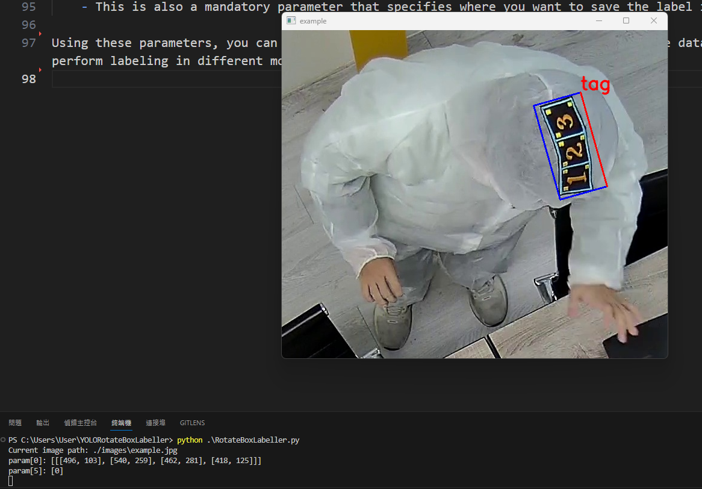

# YOLORotateBoxLabeller

The Rotational Box Labeling Assistant is a powerful tool built on cv2, designed specifically for machine learning and computer vision researchers, aimed at simplifying the process of creating rotational box datasets. This tool allows you to annotate images in an intuitive manner and automatically save your labels, offering the following advantages:

## Key Features:
1. Rapid Creation of Rotational Box Datasets:The Rotational Box Labeling Assistant enables you to effortlessly create rotational box datasets. By interacting with images, you can swiftly label objects within them and easily adjust the position and angle of the rotational boxes, ensuring the accuracy of your dataset.
2. Keyboard Fine-Tuning Functionality:To guarantee precise annotations, we provide keyboard fine-tuning functionality, allowing you to easily adjust the size of all four sides of the rotational boxes. This facilitates perfect alignment with the objects of interest without the need for cumbersome manual operations.
3. Automatic Label Saving:The Rotational Box Labeling Assistant offers automatic label saving, eliminating the hassle of manual saving. Once you complete the annotation, the labels will be saved automatically, ensuring the secure preservation of your work.

## How to Use
1. First, you need to git clone https://github.com/milk333445/YOLORotateBoxLabeller.git
2. Download the necessary Python packages
```python=
git clone https://github.com/milk333445/YOLOLabelMaster.git
cd YOLORotateBoxLabeller
pip install -r requirements.txt
```

## Quick Start: Prepare Your Data
1. Before you begin, please make sure you have prepared a folder containing the image dataset you want to label (it must contain .jpg, .jpeg, or .png image files). Note that any other file formats will be automatically ignored by the program.
2. Prepare an empty folder that will be used to store your label data files (.txt). The program will generate corresponding labels in this folder.


## Data format
1. Our annotation generation method is designed to provide a structured and efficient way to label objects within images using a specific format. The annotations consist of the following elements, ordered from left to right, representing a clockwise coordinate system:
```python=
  x1      y1       x2        y2       x3       y3       x4       y4       classname     diffcult

 465.0   287.0    418.0     123.0    490.0    102.0    537.0    267.0        tag           0
```

## Quick Start: Configure RotateBoxLabeller_settings.yaml
1. Before using this tool, you need to configure RotateBoxLabeller_settings.yaml to set the object classes you want to label. You can define class names by editing the "classes" field in autolabel_settings.yaml. Please be aware that class names will be encoded in the order they appear in the file, such as 0, 1, 2, and so on, so pay special attention to this part.
```python=
classes:
  - A # 0
  - B # 1
  - C # 2
  - D # 3
  、
  、
  、
```

2. Additionally, you can customize "key_actions" based on your personal preferences to configure custom keyboard triggers for adjusting labeling methods to meet your needs.
```python=
key_actions:
  27: 'exit' # esc
  61: 'plus' # =
  45: 'minus' # -
  109: 'minus' # -
  9: 'switch_next_side' # tab
  98: 'delete'  # b
  66: 'delete'  # B
  119: 'switch_prev' # w
  115: 'switch_next' # s
  87: 'switch_prev' # W
  83: 'switch_next' # S
  13: 'save' # enter
  65: 'previous' # a
  97: 'previous' # A
  100: 'pass' # d
  68: 'pass' # D
```
- Here are some explanations:
  - Esc (27): Exit annotation mode. Pressing the 'esc' key allows you to exit the annotation process.

  - = (61) or +: Increase the size of a selected side of the bounding box. This key allows you to expand a specific side of the bounding box.

  - (-) (45) or (-) (109): Decrease the size of a selected side of the bounding box. Use this key to reduce the size of a particular side of the bounding box.

  - Tab (9): Switch to the next side for adjustment. Press 'tab' to toggle between sides for resizing.

  - B (66) or b (98): Delete the currently selected bounding box. 'B' and 'b' keys can be used to remove the active bounding box.

  - W (87) or w (119): Switch to the previous class label. These keys allow you to cycle through class labels in reverse order.

  - S (83) or s (115): Switch to the next class label. 'S' and 's' keys help you navigate through class labels in forward order.

  - Enter (13): Save the annotation coordinates. Press 'enter' to save the current annotation, ensuring that the changes are recorded.

  - A (65) or a (97): Move to the previous image. These keys allow you to navigate to the previous image in your dataset.

  - D (68) or d (100): Move to the next image. Use 'D' and 'd' keys to proceed to the next image in your dataset.

## Quick Start: Launching the Main Program and Setting Parameters
```python=
python RotateBoxLabeller.py --last_time_num [last image number] --source [image folder path] --store [label storage path]
```
- You don't need to configure all parameters every time. Here are detailed explanations of some important parameters such as mode, last_time_num, weights, source, and store:
  - last_time_num (Last Image Number):
    - This parameter allows you to quickly jump to a specific image number. If you have previously labeled the first five images, you can input last_time_num 6 to directly jump to labeling the sixth image.
  - source (Image Folder Path):
    - This is a mandatory parameter that specifies the path to the folder containing the images you want to label. 
  - store (Label Storage Path):
    - This is also a mandatory parameter that specifies where you want to save the label information.

